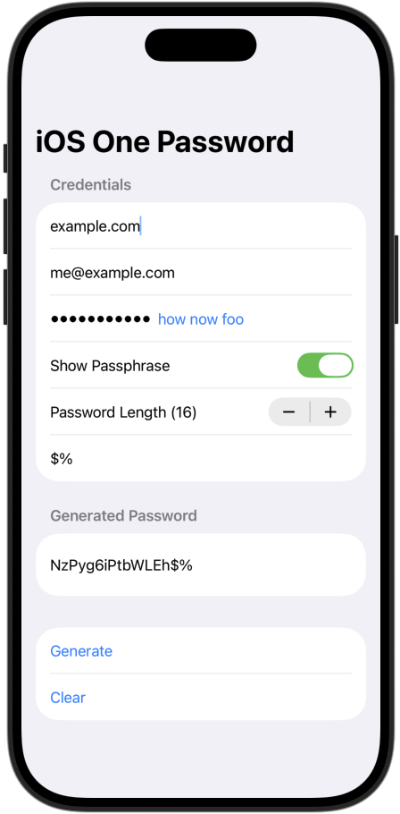

# About

This is an iOS version of [go-one-password](https://github.com/dpapathanasiou/go-one-password/), using [SwiftUI](https://developer.apple.com/swiftui/) instead of [GTK](https://www.gtk.org/), while performing the same computations found in [onepassword.go](https://github.com/dpapathanasiou/go-one-password/blob/master/onepassword/onepassword.go), at the core of the [go-one-password](https://github.com/dpapathanasiou/go-one-password/) project.

Being a newbie to both [Swift](https://www.swift.org/) and iOS development in general, I enlisted the aid of [devstral:latest](https://ollama.com/library/devstral) and [gpt-oss:latest](https://ollama.com/library/gpt-oss), running locally on [Ollama](https://ollama.com/).

     

